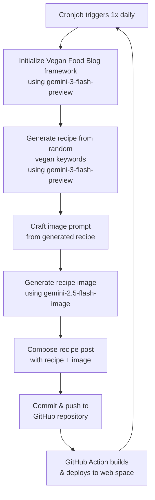

# Recipe Generation Flow

```mermaid
flowchart TD
    A[Cronjob triggers 1x daily] --> B[Initialize Vegan Food Blog framework\nusing gemini-3-flash-preview]
    B --> C[Generate recipe from random\nvegan keywords\nusing gemini-3-flash-preview]
    C --> D[Craft image prompt\nfrom generated recipe]
    D --> E[Generate recipe image\nusing gemini-2.5-flash-image]
    E --> F[Compose recipe post\nwith recipe + image]
    F --> G[Commit & push to\nGitHub repository]
    G --> H[GitHub Action builds\n& deploys to web space]
    H --> A
```
